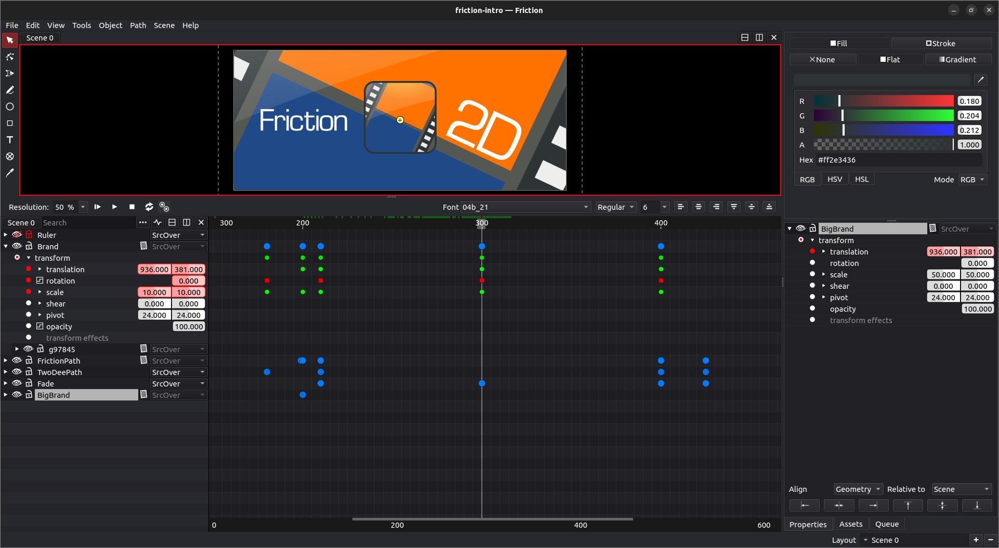

### 2D motion graphics and animation software for Linux.

* Very flexible user interface
* Import images, videos and SVG
* Supports expressions using Javascript
* Supports vector and raster effects
* Export to web (SVG animation)
* Export to image(s) and video (through ffmpeg)

***This application is beta quality, expect missing and/or broken features.***

## Resources

* **[Project](https://github.com/friction2d/friction)**
* **[Issue tracker](https://github.com/friction2d/friction/issues)**
* **[Discussions](https://github.com/friction2d/friction/discussions)**
* **[Snapshots](https://sourceforge.net/projects/friction/files/snapshots/)**
