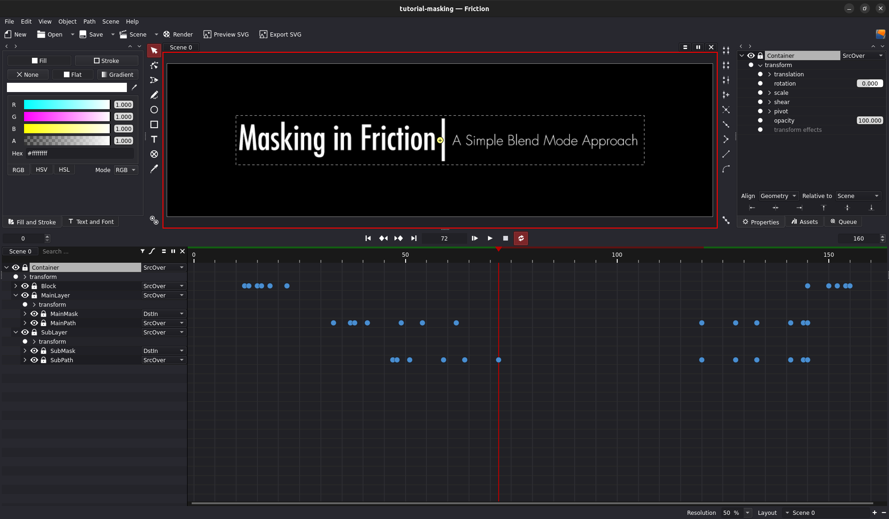

# Masking in Friction

Friction offers a straightforward method for masking elements using its blend modes:

1. **Group Desired Elements:** Combine the objects you want to mask into a single group.
2. **Convert Group to Layer:** Promote the group to a layer for easier manipulation. **This step is essential for SVG export.**
3. **Apply Blend Mode:** Set the blend mode of the element you want to use as a mask to `DstIn` (or another suitable mode for your desired effect).
  * **Note:** For SVG export, `DstIn` is currently the only supported blend mode.

**[Download Example Project](../assets/tutorials/tutorial-masking.friction)**
